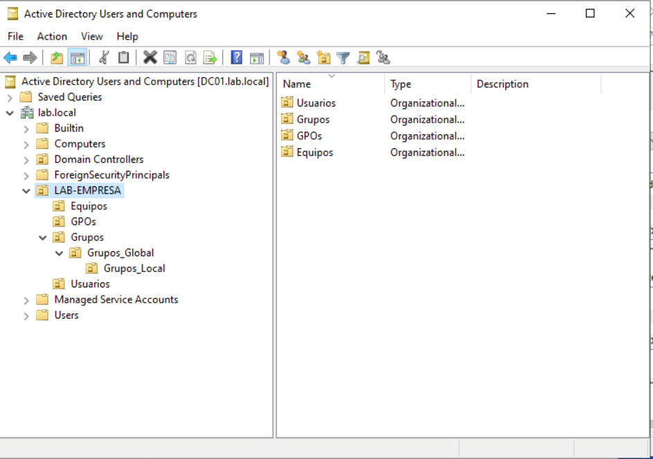
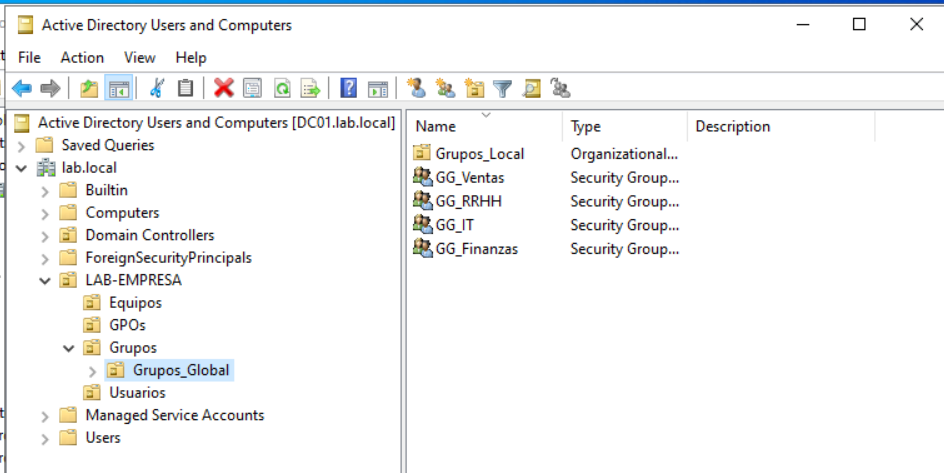
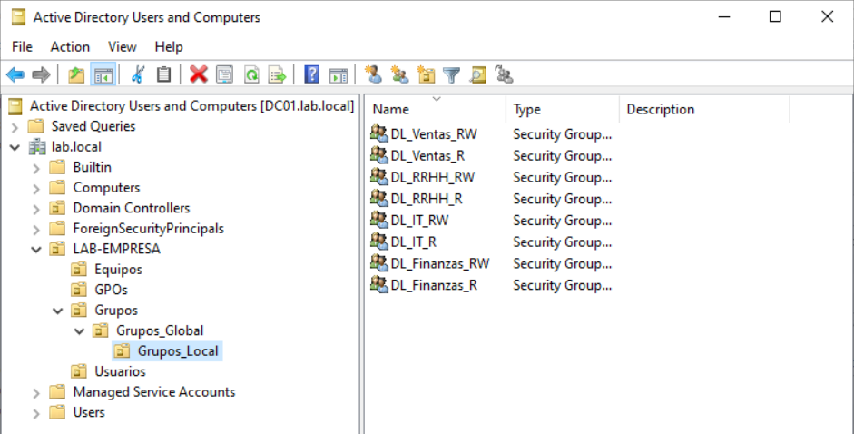
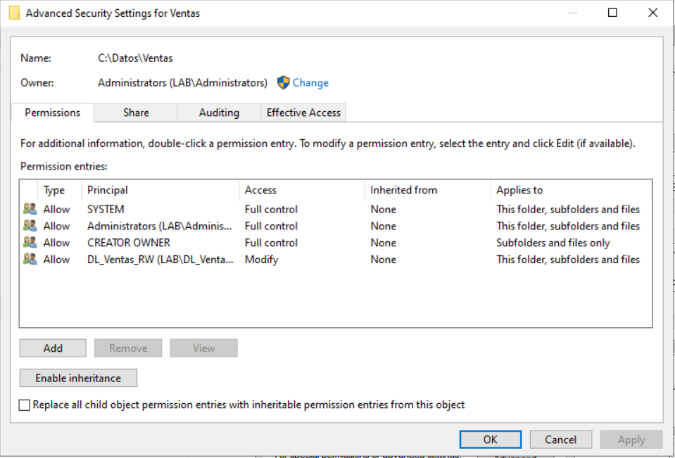

# IT Support Lab – Active Directory Environment

## 📌 Project Overview

This repository documents a hands-on IT Support lab focused on Active Directory administration, group management, NTFS permissions, and Group Policy configuration.

The goal of this lab is to simulate a small enterprise environment with multiple departments and structured access control using best practices.

---

## 🏗 Lab Environment

- Windows Server (Domain Controller)
- Domain: lab.local
- Department-based OU structure
- Shared folders per department (Ventas, Finanzas, IT, RRHH)

## 📷 Lab Evidence

### Active Directory OU Structure

---

## 👥 Active Directory Structure

Implemented ADLP model:

Accounts → Global Groups → Domain Local Groups → Permissions

Example:

User  
→ GG_Ventas
→ DL_Ventas_RW
→ NTFS Modify permission on shared folder
## 📷 Lab Evidence

### Active Directory OU Structure

### Global Groups

### Domain Local Groups

### NTFS Permissions – Ventas Folder

---

## 🔐 Permissions Design

- No direct user permissions
- Global Groups represent organizational logic
- Domain Local Groups manage resource permissions
- Read and Modify access separated by design
- Principle of Least Privilege applied

---

## 🗂 Group Policy Configuration

- Drive mapping via GPO
- User Configuration → Preferences → Drive Maps
- Item-level targeting based on Global Groups
- Automatic drive assignment per department

---

## 🛠 Troubleshooting Experience

- Resolved corrupted user.config issue in Server Manager
- Fixed ServerList.xml corruption
- Diagnosed effective permissions conflicts
- Understood permission inheritance and group nesting behavior

---

## 🎯 Learning Outcome

This lab strengthened understanding of:

- Active Directory group design
- NTFS permission hierarchy
- GPO targeting logic
- Effective permission analysis
- Structured IT troubleshooting methodology

- ---

## 🧠 Support Scenarios Practiced

- User cannot see mapped drive (drive mapping troubleshooting)
- Validating group membership in Active Directory
- Using gpupdate and gpresult for GPO troubleshooting
- Analyzing effective NTFS permissions
- Handling profile configuration corruption issues

---

## 🔄 What I Would Improve Next

- Implement PowerShell script for automated user creation
- Simulate multi-department access conflicts
- Configure basic backup strategy for shared folders
- Add second server for redundancy testing
